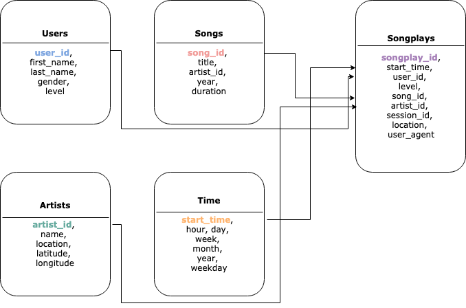

## Data Pipelines with Airflow
Getting started with airflow  
```
  ____________       _____________
 ____    |__( )_________  __/__  /________      __
____  /| |_  /__  ___/_  /_ __  /_  __ \_ | /| / /
___  ___ |  / _  /   _  __/ _  / / /_/ /_ |/ |/ /
 _/_/  |_/_/  /_/    /_/    /_/  \____/____/|__/
```

 
### Installing and starting

#### Installing Python Dependencies
You need to install this python dependencies
In Terminal/CommandPrompt:  

without anaconda you can do this:
```
$ python3 -m venv virtual-env-name
$ source virtual-env-name/bin/activate
$ pip install -r requirements.txt
```
with anaconda you can do this (in Windows):
```
$ conda env create -f env.yml
$ source activate <conda-env-name>
```
or (in Others)
```
conda create -y -n <conda-env-name> python==3.6
conda install -f -y -q -n <conda-env-name> -c conda-forge --file requirements.txt
[source activate/ conda activate] <conda-env-name>
```
#### Fixing/Configuring Airflow
```
$ pip install --upgrade Flask
$ pip install zappa
$ mkdir airflow_home
$ export AIRFLOW_HOME=./airflow_home
$ cd airflow_home
$ airflow initdb
$ airflow webserver
$ airflow scheduler
```

#### More Airflow commands
To list existing dags registered with airflow
```
$ airflow list_dags
```

#### Secure/Encrypt your connections and hooks
**Run**
```bash
$ python cryptosetup.py
```
copy this key to *airflow.cfg* to paste after   
fernet_key = ************

#### Setting up connections and variables in Airflow UI
TODO: There is no code to modify in this exercise. We're going to 
create a connection and a variable.  

**S3**
1. Open your browser to localhost:8080 and open Admin->Variables
2. Click "Create"
3. Set "Key" equal to "s3_bucket" and set "Val" equal to "udacity-dend"
4. Set "Key" equal to "s3_prefix" and set "Val" equal to "data-pipelines"
5. Click save  

**AWS**
1. Open Admin->Connections
2. Click "Create"
3. Set "Conn Id" to "aws_credentials", "Conn Type" to "Amazon Web Services"
4. Set "Login" to your aws_access_key_id and "Password" to your aws_secret_key
5. Click save
6. If it doesn't work then in "Extra" field put:  
{"region_name": "your_aws_region", "aws_access_key_id":"your_aws_access_key_id", "aws_secret_access_key": "your_aws_secret_access_key"} 
7. These are all you can put:
- aws_account_id: AWS account ID for the connection
- aws_iam_role: AWS IAM role for the connection
- external_id: AWS external ID for the connection
- host: Endpoint URL for the connection
- region_name: AWS region for the connection
- role_arn: AWS role ARN for the connection

**Redshift**
1. Open Admin->Connections
2. Click "Create"
3. Set "Conn Id" to "redshift", "Conn Type" to "postgres"
4. Set "Login" to your master_username for your cluster and "Password" 
to your master_password for your cluster
5. Click save

### About the data
Song Data is collected from the Million Song Dataset   
Check: http://millionsongdataset.com/

Log Data is generated artificially  
Check: https://github.com/Interana/eventsim

### The schema we are going to design here

Here you can see the Songplays table is actually the facts and others 
connecting to it are dimensions. It's a simple star schema and the first
 bold and colorful column name is the primary key for this table which 
 are serving as foreign keys in Songplays table.
 
### The dag we are going to design here


### View and Analyze
- The Tester.ipynb notebook is there to test your data with different
queries (already some pre-written there)
- The connection to the cluster is already written, you just have to
    - fill up your cluster end point and iam role
    - execute block by block to run the queries
    
### Example Queries
For the most popular songs over the time (considering your schema name 
is sparkify)
```
SELECT s.title, count(*) as count
FROM sparkify.songplays sp
INNER JOIN sparkify.songs s ON s.song_id = sp.song_id
GROUP BY s.title
ORDER BY count DESC, s.title ASC
```
For the most popular artists and their songs over the time (considering 
your schema name is sparkify)
```
SELECT ar.name, s.title, count(*) as count
FROM sparkify.songplays sp
INNER JOIN sparkify.songs s ON s.song_id = sp.song_id
INNER JOIN sparkify.artists ar ON ar.artist_id = sp.artist_id
GROUP BY ar.name, s.title
ORDER BY count DESC, ar.name, s.title ASC;
```

#### Links for Airflow
**Context Variables**  
https://airflow.apache.org/macros.html

**Hacks**  
https://medium.com/datareply/airflow-lesser-known-tips-tricks-and-best-practises-cf4d4a90f8f  
https://medium.com/handy-tech/airflow-tips-tricks-and-pitfalls-9ba53fba14eb  
https://www.astronomer.io/guides/dag-best-practices/